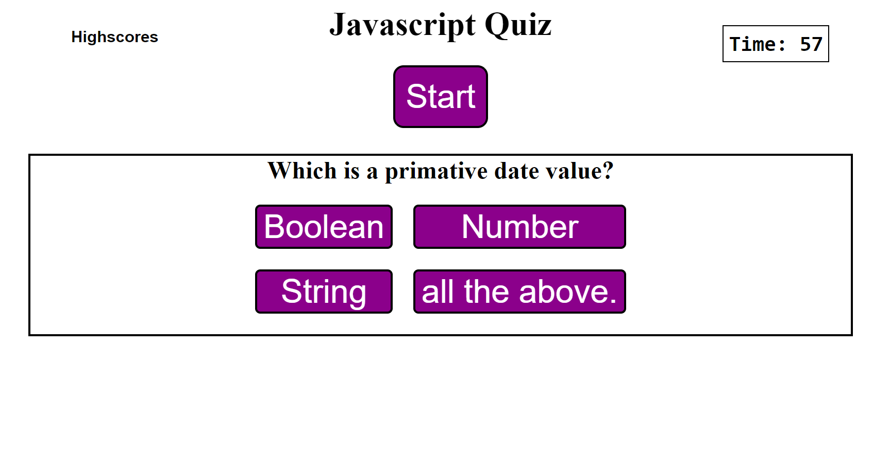

# Javascript-Quiz

## Description

Short javascript quiz that will test the users knowledge of beginer javascript concepts.

## Installation
N/A

## Usage

Clicking the start button presents user with a series of five questions.
 Each question is worth 20 points and total score is calculated at the end.
User is then presented with the option to 'submit your score' and a blank text box to input their name.

link: https://bryandalton.github.io/Javascript-Quiz/

## Credits
-Bryan Dalton 

-Web Dev Simplified "Build A Quiz App With JavaScript": https://www.youtube.com/watch?v=riDzcEQbX6k

## License
N/A
